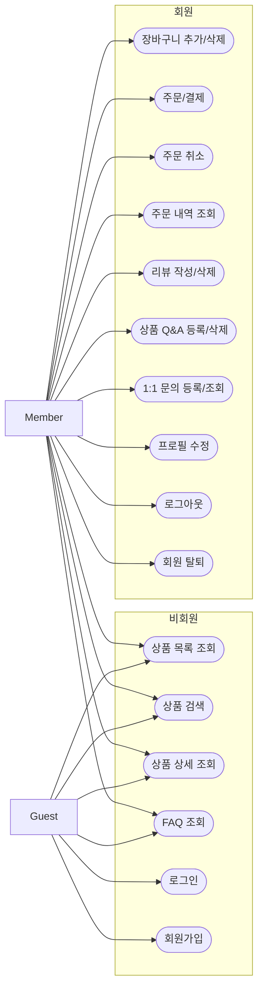
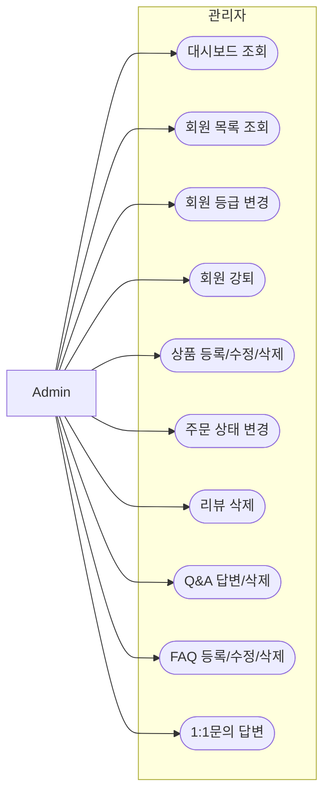
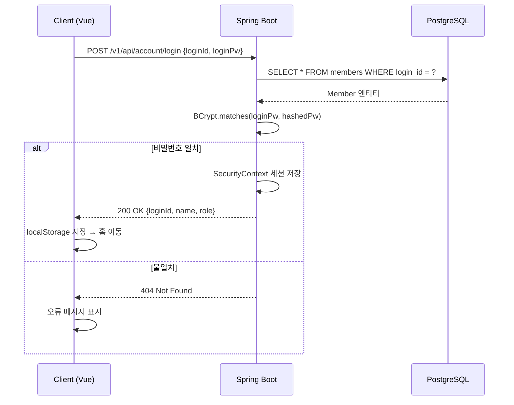
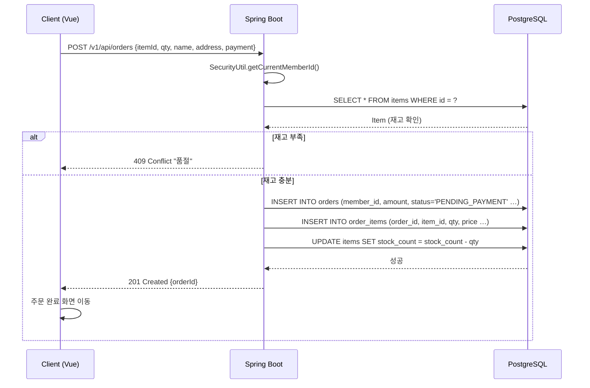
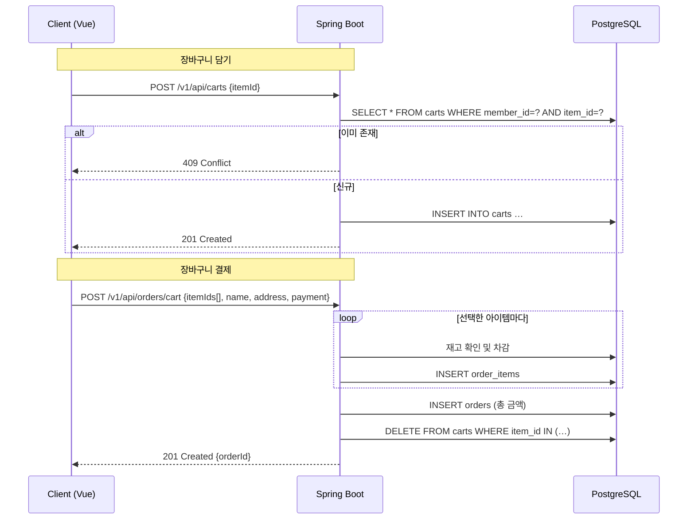
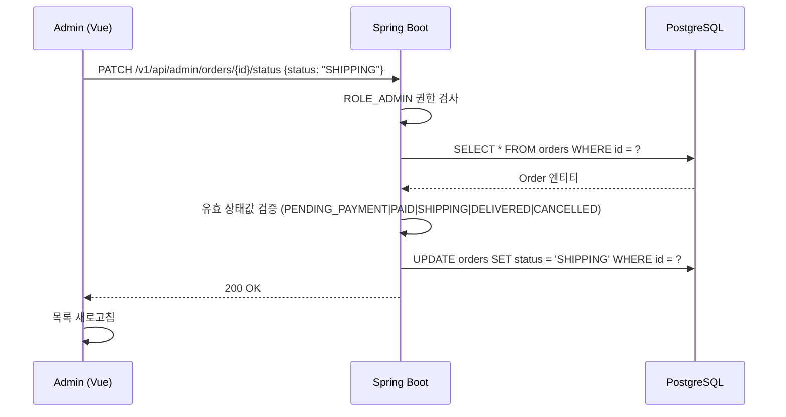
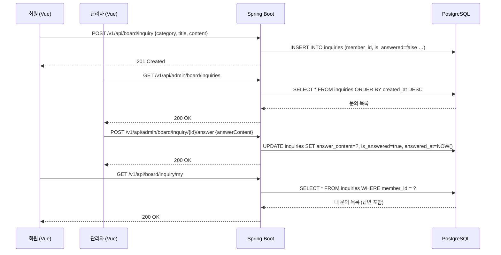
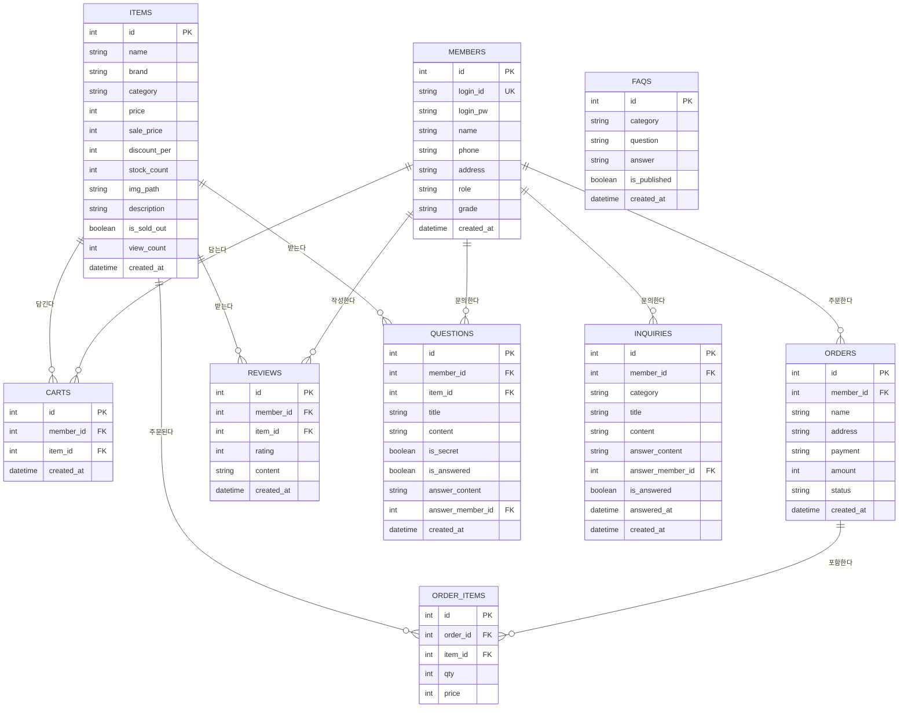

# VENTALIZE (벙딸리제) — 온라인 쇼핑몰 포트폴리오

> **스카프 · 기성복 · 향수 · 악세사리 · 가방** 전문 럭셔리 온라인 쇼핑몰
> Spring Boot 3 · Vue 3 · PostgreSQL 기반 풀스택 웹 애플리케이션

---

## 목차

1. [프로젝트 개요](#1-프로젝트-개요)
2. [기술 스택](#2-기술-스택)
3. [프로젝트 구조](#3-프로젝트-구조)
4. [유스케이스 다이어그램](#4-유스케이스-다이어그램)
5. [시퀀스 다이어그램](#5-시퀀스-다이어그램)
6. [개념적 설계 (E-R 다이어그램)](#6-개념적-설계)
7. [논리적 설계 (테이블 정의서)](#7-논리적-설계)
8. [물리적 설계 (DDL · 인덱스)](#8-물리적-설계)
9. [아키텍처 설계](#9-아키텍처-설계)
10. [API 명세](#10-api-명세)
11. [설치 및 실행 가이드](#11-설치-및-실행-가이드)
12. [테스트 계정](#12-테스트-계정)

---

## 1. 프로젝트 개요

### 1.1 개발 배경 및 목적

VENTALIZE(벙딸리제)는 Hermès · Kinfolk 스타일의 미니멀 럭셔리 컨셉을 가진 온라인 패션/뷰티 쇼핑몰이다. 일반적인 대형 마켓플레이스(무신사 등)와 달리 소수 프리미엄 카테고리에 집중하고, 에디토리얼 이미지 중심의 UX를 제공하는 것을 목표로 한다.

### 1.2 주요 기능 요약

| 구분 | 기능 |
|------|------|
| 회원 | 회원가입 · 로그인(세션) · 프로필 수정 · 회원 탈퇴 |
| 상품 | 카테고리 탐색 · 키워드 검색 · 상세 조회 · 정렬 |
| 장바구니 | 담기 · 삭제 · 선택 주문 |
| 주문/결제 | 즉시 구매 · 장바구니 결제 · 배송 추적 · 주문 취소 |
| 리뷰/Q&A | 별점 리뷰 · 상품 문의(비밀글) |
| 게시판 | FAQ 조회 · 1:1 문의 등록 및 답변 확인 |
| 관리자 | 대시보드 · 회원/상품/주문/리뷰/Q&A/FAQ/문의 관리 |

### 1.3 배송 상태 흐름

```
결제대기(PENDING_PAYMENT) → 결제완료(PAID) → 배송중(SHIPPING) → 배송완료(DELIVERED)
                                    ↘               ↘
                                         취소(CANCELLED)
```

---

## 2. 기술 스택

| 계층 | 기술 | 버전 |
|------|------|------|
| **Backend** | Spring Boot | 3.2.0 |
| | Spring Security | 6.x (Session 기반) |
| | Spring Data JPA | 3.2.x |
| | Hibernate | 6.4.x |
| | Gradle | 8.x |
| | Java | 21 |
| **Frontend** | Vue.js | 3.5 |
| | Vue Router | 4.x |
| | Vite | 8.x |
| **Database** | PostgreSQL | 15+ |
| | HikariCP | (기본 내장) |
| **인증** | Spring Session | 세션 쿠키 방식 |
| **암호화** | BCrypt | Spring Security 내장 |
| **디자인** | Cormorant Garamond | Google Fonts |
| | Inter | Google Fonts |

### 2.1 선택 근거

- **Spring Boot 3 + Java 21**: LTS 버전, Virtual Thread 지원, 성능 향상
- **Vue 3 Composition API**: 반응형 상태 관리가 단순하고 TypeScript 친화적
- **세션 기반 인증**: 별도 토큰 저장소 불필요, CSRF 방어 용이
- **PostgreSQL**: ACID 트랜잭션, JSON 지원, 풍부한 인덱스 옵션

---

## 3. 프로젝트 구조

```
shop_musinsa/                          # 저장소 루트
├── shop_ventalize/                    # 백엔드 모듈
│   ├── shop/
│   │   ├── build.gradle
│   │   ├── settings.gradle
│   │   └── src/
│   │       └── main/
│   │           ├── java/com/ventalize/shop/
│   │           │   ├── ShopApplication.java
│   │           │   ├── account/               # 인증 (로그인·회원가입·로그아웃)
│   │           │   │   ├── controller/        AccountController
│   │           │   │   ├── dto/               AccountJoinRequest, AccountLoginRequest
│   │           │   │   ├── etc/               AccountConstants
│   │           │   │   └── helper/            AccountHelper, SessionAccountHelper
│   │           │   ├── member/                # 회원 도메인
│   │           │   │   ├── entity/            Member
│   │           │   │   ├── dto/               MemberRead, MemberUpdateRequest
│   │           │   │   ├── repository/        MemberRepository
│   │           │   │   └── service/           MemberService, CustomUserDetailsService
│   │           │   ├── item/                  # 상품 도메인
│   │           │   │   ├── entity/            Item
│   │           │   │   ├── dto/               ItemRead, ItemCreateRequest
│   │           │   │   ├── repository/        ItemRepository
│   │           │   │   └── service/           ItemService
│   │           │   ├── cart/                  # 장바구니 도메인
│   │           │   │   ├── entity/            Cart
│   │           │   │   ├── dto/               CartRead, CartRequest
│   │           │   │   ├── repository/        CartRepository
│   │           │   │   └── service/           CartService
│   │           │   ├── order/                 # 주문 도메인
│   │           │   │   ├── entity/            Order, OrderItem
│   │           │   │   ├── dto/               OrderRead, OrderRequest
│   │           │   │   ├── repository/        OrderRepository, OrderItemRepository
│   │           │   │   └── service/           OrderService, OrderItemService
│   │           │   ├── review/                # 리뷰 도메인
│   │           │   │   ├── entity/            Review
│   │           │   │   ├── dto/               ReviewRead, ReviewRequest
│   │           │   │   ├── repository/        ReviewRepository
│   │           │   │   └── service/           ReviewService
│   │           │   ├── qna/                   # 상품 Q&A 도메인
│   │           │   │   ├── entity/            Question
│   │           │   │   ├── dto/               QuestionRead, QuestionCreateRequest
│   │           │   │   ├── repository/        QuestionRepository
│   │           │   │   └── service/           QnAService
│   │           │   ├── board/                 # 게시판 (FAQ · 1:1문의)
│   │           │   │   ├── entity/            Faq, Inquiry
│   │           │   │   ├── dto/               FaqRead, InquiryRead …
│   │           │   │   ├── repository/        FaqRepository, InquiryRepository
│   │           │   │   └── controller/        FaqController, InquiryController
│   │           │   ├── admin/                 # 관리자 API
│   │           │   │   └── controller/        AdminDashboardController
│   │           │   │                          AdminItemController
│   │           │   │                          AdminMemberController
│   │           │   │                          AdminOrderController
│   │           │   │                          AdminReviewController
│   │           │   │                          AdminQnAController
│   │           │   │                          AdminBoardController
│   │           │   └── common/                # 공통 설정 및 유틸
│   │           │       ├── config/            SecurityConfig, CorsConfig
│   │           │       │                      AdminInitializer, FileStorageService
│   │           │       ├── filter/            StartupSessionFilter
│   │           │       └── util/              SecurityUtil, HttpUtils
│   │           └── resources/
│   │               └── application.yml
│   └── ventalize_ddl.sql              # DB 초기화 SQL (테이블 + 샘플 데이터 96개)
│
└── frontend/                          # 프론트엔드 모듈 (Vue 3)
    ├── index.html
    ├── package.json
    ├── vite.config.js
    └── src/
        ├── main.js
        ├── style.css                  # 전역 디자인 시스템 (CSS 변수·컴포넌트)
        ├── App.vue
        ├── router/
        │   └── index.js               # Vue Router 설정 (인증 가드 포함)
        ├── composables/
        │   └── useAuth.js             # 인증 상태 관리 (localStorage 기반)
        ├── components/
        │   ├── Header.vue             # 전역 헤더 (공지바·로고·네비·검색)
        │   └── Footer.vue             # 전역 푸터
        └── views/
            ├── Home.vue               # 메인 페이지 (히어로·에디토리얼 섹션)
            ├── Category.vue           # 카테고리·검색 결과
            ├── ProductDetail.vue      # 상품 상세 (리뷰·Q&A 탭)
            ├── Login.vue              # 로그인
            ├── Register.vue           # 회원가입
            ├── Cart.vue               # 장바구니
            ├── CartCheckout.vue       # 장바구니 결제
            ├── Checkout.vue           # 즉시 구매 결제
            ├── MyPage.vue             # 마이페이지
            ├── admin/
            │   ├── AdminLayout.vue    # 관리자 레이아웃
            │   ├── Dashboard.vue      # 매출·재고·문의 현황
            │   ├── Orders.vue         # 주문 관리
            │   ├── Members.vue        # 회원 관리
            │   ├── Products.vue       # 상품 관리
            │   ├── Reviews.vue        # 리뷰 관리
            │   ├── QnA.vue            # Q&A 관리
            │   └── Board.vue          # FAQ · 1:1문의 관리
            └── board/
                ├── BoardLayout.vue    # 게시판 레이아웃
                ├── Faq.vue            # FAQ 아코디언
                └── Inquiry.vue        # 1:1 문의
```

---

## 4. 유스케이스 다이어그램

### 4.1 전체 액터 정의

| 액터 | 설명 |
|------|------|
| **비회원(Guest)** | 로그인하지 않은 방문자 |
| **회원(Member)** | 로그인된 일반 사용자 |
| **관리자(Admin)** | ROLE_ADMIN 권한 보유자 |

### 4.2 회원 유스케이스



### 4.3 관리자 유스케이스



---

## 5. 시퀀스 다이어그램

### 5.1 로그인



### 5.2 상품 주문 (즉시 구매)



### 5.3 장바구니 담기 → 결제



### 5.4 관리자 주문 상태 변경



### 5.5 1:1 문의 등록 및 답변



---

## 6. 개념적 설계

### 6.1 E-R 다이어그램



### 6.2 도메인 관계 요약

| 관계 | 카디널리티 | 설명 |
|------|-----------|------|
| 회원 - 장바구니 | 1 : N | 한 회원이 여러 상품을 담을 수 있음 |
| 회원 - 주문 | 1 : N | 한 회원이 여러 번 주문 가능 |
| 주문 - 주문상품 | 1 : N | 하나의 주문에 여러 상품 포함 |
| 상품 - 주문상품 | 1 : N | 하나의 상품이 여러 주문에 포함 |
| 회원 - 리뷰 | 1 : N | 한 회원이 여러 리뷰 작성 |
| 상품 - 리뷰 | 1 : N | 하나의 상품에 여러 리뷰 |
| 회원 - Q&A | 1 : N | 한 회원이 여러 Q&A 등록 |
| 회원 - 1:1문의 | 1 : N | 한 회원이 여러 문의 등록 |

---

## 7. 논리적 설계

### 7.1 members (회원)

| 컬럼명 | 데이터 타입 | 제약조건 | 설명 |
|--------|------------|---------|------|
| id | SERIAL | PK | 회원 고유 번호 |
| login_id | VARCHAR(100) | UNIQUE, NOT NULL | 이메일 (로그인 ID) |
| login_pw | VARCHAR(255) | NOT NULL | BCrypt 암호화 비밀번호 |
| name | VARCHAR(50) | NOT NULL | 회원 이름 |
| phone | VARCHAR(20) | | 연락처 |
| address | TEXT | | 기본 배송지 |
| role | VARCHAR(20) | DEFAULT 'ROLE_USER' | 권한 (ROLE_USER / ROLE_ADMIN) |
| grade | VARCHAR(20) | DEFAULT 'BRONZE' | 회원 등급 |
| created_at | TIMESTAMP | DEFAULT NOW() | 가입일시 |

### 7.2 items (상품)

| 컬럼명 | 데이터 타입 | 제약조건 | 설명 |
|--------|------------|---------|------|
| id | SERIAL | PK | 상품 고유 번호 |
| name | VARCHAR(200) | NOT NULL | 상품명 |
| brand | VARCHAR(100) | NOT NULL | 브랜드명 |
| category | VARCHAR(50) | NOT NULL | 카테고리 코드 |
| price | INTEGER | NOT NULL | 정가 (원) |
| sale_price | INTEGER | NOT NULL | 판매가 (원) |
| discount_per | INTEGER | DEFAULT 0 | 할인율 (%) |
| stock_count | INTEGER | DEFAULT 0 | 재고 수량 |
| img_path | TEXT | | 상품 이미지 경로 |
| description | TEXT | | 상품 설명 |
| is_sold_out | BOOLEAN | DEFAULT false | 품절 여부 |
| view_count | INTEGER | DEFAULT 0 | 조회수 |
| created_at | TIMESTAMP | DEFAULT NOW() | 등록일시 |

### 7.3 carts (장바구니)

| 컬럼명 | 데이터 타입 | 제약조건 | 설명 |
|--------|------------|---------|------|
| id | SERIAL | PK | 장바구니 항목 번호 |
| member_id | INTEGER | FK(members.id) | 회원 번호 |
| item_id | INTEGER | FK(items.id) | 상품 번호 |
| created_at | TIMESTAMP | DEFAULT NOW() | 담은 일시 |

### 7.4 orders (주문)

| 컬럼명 | 데이터 타입 | 제약조건 | 설명 |
|--------|------------|---------|------|
| id | SERIAL | PK | 주문 번호 |
| member_id | INTEGER | FK(members.id) | 주문자 번호 |
| name | VARCHAR(100) | NOT NULL | 수령인 이름 |
| address | TEXT | NOT NULL | 배송 주소 |
| payment | VARCHAR(50) | NOT NULL | 결제 수단 |
| amount | BIGINT | NOT NULL | 결제 금액 |
| status | VARCHAR(20) | DEFAULT 'PENDING_PAYMENT' | 배송 상태 |
| created_at | TIMESTAMP | DEFAULT NOW() | 주문 일시 |

> **status 허용값**: `PENDING_PAYMENT` / `PAID` / `SHIPPING` / `DELIVERED` / `CANCELLED`

### 7.5 order_items (주문 상품)

| 컬럼명 | 데이터 타입 | 제약조건 | 설명 |
|--------|------------|---------|------|
| id | SERIAL | PK | 주문 상품 번호 |
| order_id | INTEGER | FK(orders.id) | 주문 번호 |
| item_id | INTEGER | FK(items.id) | 상품 번호 |
| qty | INTEGER | NOT NULL | 주문 수량 |
| price | INTEGER | NOT NULL | 주문 시점 단가 |

### 7.6 reviews (리뷰)

| 컬럼명 | 데이터 타입 | 제약조건 | 설명 |
|--------|------------|---------|------|
| id | SERIAL | PK | 리뷰 번호 |
| member_id | INTEGER | FK(members.id) | 작성자 번호 |
| item_id | INTEGER | FK(items.id) | 상품 번호 |
| rating | INTEGER | NOT NULL, CHECK(1~5) | 별점 |
| content | TEXT | NOT NULL | 리뷰 내용 |
| created_at | TIMESTAMP | DEFAULT NOW() | 작성 일시 |

### 7.7 questions (상품 Q&A)

| 컬럼명 | 데이터 타입 | 제약조건 | 설명 |
|--------|------------|---------|------|
| id | SERIAL | PK | Q&A 번호 |
| member_id | INTEGER | FK(members.id) | 작성자 번호 |
| item_id | INTEGER | FK(items.id) | 상품 번호 |
| title | VARCHAR(200) | NOT NULL | 제목 |
| content | TEXT | NOT NULL | 내용 |
| is_secret | BOOLEAN | DEFAULT false | 비밀글 여부 |
| is_answered | BOOLEAN | DEFAULT false | 답변 여부 |
| answer_content | TEXT | | 답변 내용 |
| answer_member_id | INTEGER | FK(members.id) | 답변 관리자 번호 |
| created_at | TIMESTAMP | DEFAULT NOW() | 작성 일시 |

### 7.8 faqs (FAQ)

| 컬럼명 | 데이터 타입 | 제약조건 | 설명 |
|--------|------------|---------|------|
| id | SERIAL | PK | FAQ 번호 |
| category | VARCHAR(50) | NOT NULL | 분류 (배송/교환반품/결제 등) |
| question | TEXT | NOT NULL | 질문 |
| answer | TEXT | NOT NULL | 답변 |
| is_published | BOOLEAN | DEFAULT true | 게시 여부 |
| created_at | TIMESTAMP | DEFAULT NOW() | 등록 일시 |
| updated_at | TIMESTAMP | | 수정 일시 |

### 7.9 inquiries (1:1 문의)

| 컬럼명 | 데이터 타입 | 제약조건 | 설명 |
|--------|------------|---------|------|
| id | SERIAL | PK | 문의 번호 |
| member_id | INTEGER | FK(members.id) | 작성자 번호 |
| category | VARCHAR(50) | NOT NULL | 문의 유형 |
| title | VARCHAR(200) | NOT NULL | 제목 |
| content | TEXT | NOT NULL | 내용 |
| answer_content | TEXT | | 답변 내용 |
| answer_member_id | INTEGER | FK(members.id) | 답변 관리자 번호 |
| is_answered | BOOLEAN | DEFAULT false | 답변 완료 여부 |
| answered_at | TIMESTAMP | | 답변 일시 |
| created_at | TIMESTAMP | DEFAULT NOW() | 작성 일시 |

---

## 8. 물리적 설계

### 8.1 DDL 개요

전체 DDL은 `shop_ventalize/ventalize_ddl.sql` 파일에 포함되어 있으며 아래 구성을 갖는다.

```
1. 기존 테이블 삭제 (CASCADE)
2. 테이블 생성 (members, items, carts, orders, order_items,
                reviews, questions, faqs, inquiries)
3. 인덱스 생성
4. 샘플 데이터 INSERT
   - 관리자 계정 1개
   - 테스트 회원 3개 (BCrypt 암호화)
   - 상품 96개 (카테고리별 16개)
   - FAQ 12개
```

### 8.2 주요 인덱스

```sql
-- 상품 카테고리 조회 최적화
CREATE INDEX idx_items_category ON items(category);

-- 장바구니 중복 방지 및 조회 최적화
CREATE UNIQUE INDEX idx_carts_member_item ON carts(member_id, item_id);

-- 주문 상태별 집계 최적화
CREATE INDEX idx_orders_status ON orders(status);

-- 회원별 주문 조회 최적화
CREATE INDEX idx_orders_member ON orders(member_id);

-- 상품별 리뷰 조회 최적화
CREATE INDEX idx_reviews_item ON reviews(item_id);

-- 상품별 Q&A 조회 최적화
CREATE INDEX idx_questions_item ON questions(item_id);

-- 문의 미답변 집계 최적화
CREATE INDEX idx_inquiries_answered ON inquiries(is_answered);
```

### 8.3 서버 설정 (application.yml)

```yaml
server:
  port: 8085

spring:
  application:
    name: ventalize
  datasource:
    url: jdbc:postgresql://localhost:5432/ventalize
    username: postgres
    password: 1004
    driver-class-name: org.postgresql.Driver
  jpa:
    hibernate:
      ddl-auto: update
    show-sql: false
    properties:
      hibernate.dialect: org.hibernate.dialect.PostgreSQLDialect
  servlet:
    multipart:
      max-file-size: 10MB
      max-request-size: 10MB
```

### 8.4 카테고리 코드 정의

| 코드 | 한국어 | 설명 |
|------|--------|------|
| `SCARVES` | 스카프 | 실크·울·캐시미어 스카프, 머플러 |
| `READY_TO_WEAR` | 기성복 | 블라우스, 재킷, 드레스, 팬츠 |
| `PERFUME` | 향수 | 오드퍼퓸, 오드뚜왈렛, 퍼퓸 오일 |
| `ACC` | 악세사리 | 목걸이, 이어링, 반지, 벨트, 헤어 |
| `BAG` | 가방 | 토트백, 크로스백, 클러치, 백팩 |
| `SALE` | 세일 | 시즌 오프 특가 상품 |

---

## 9. 아키텍처 설계

### 9.1 전체 시스템 구성도

```
┌──────────────────────────────────────────────────────┐
│                   브라우저 (Client)                    │
│                                                      │
│   Vue 3 SPA (Vite Dev Server :5173)                  │
│   ┌──────────┐  ┌──────────┐  ┌──────────────────┐  │
│   │  Views   │  │Components│  │  Vue Router 4    │  │
│   │ (Pages)  │  │Header    │  │  /category/:name │  │
│   │          │  │Footer    │  │  /product/:id    │  │
│   └────┬─────┘  └──────────┘  │  /admin/**       │  │
│        │ fetch() + credentials │  /board/**       │  │
│        │ → Vite Proxy /v1      └──────────────────┘  │
└────────┼─────────────────────────────────────────────┘
         │ HTTP (proxy → :8085)
┌────────▼─────────────────────────────────────────────┐
│              Spring Boot 서버 (:8085)                  │
│                                                      │
│  ┌─────────────────────────────────────────────┐     │
│  │             Spring Security                 │     │
│  │  SessionFilter → AuthenticationProvider     │     │
│  │  BCryptPasswordEncoder / CORS Config        │     │
│  └────────────────┬────────────────────────────┘     │
│                   │                                  │
│  ┌────────────────▼────────────────────────────┐     │
│  │          REST Controllers                   │     │
│  │  /v1/api/account  /v1/api/items             │     │
│  │  /v1/api/orders   /v1/api/carts             │     │
│  │  /v1/api/board    /v1/api/admin/**          │     │
│  └────────────────┬────────────────────────────┘     │
│                   │                                  │
│  ┌────────────────▼────────────────────────────┐     │
│  │           Service Layer                     │     │
│  │  ItemService / OrderService / CartService…  │     │
│  └────────────────┬────────────────────────────┘     │
│                   │                                  │
│  ┌────────────────▼────────────────────────────┐     │
│  │        Repository (Spring Data JPA)          │     │
│  │  ItemRepository / OrderRepository …         │     │
│  └────────────────┬────────────────────────────┘     │
│                   │ HikariCP Connection Pool         │
└───────────────────┼──────────────────────────────────┘
                    │ JDBC
┌───────────────────▼──────────────────────────────────┐
│              PostgreSQL 15 (:5432)                    │
│              Database: ventalize                      │
│   members / items / carts / orders / order_items     │
│   reviews / questions / faqs / inquiries             │
└──────────────────────────────────────────────────────┘
```

### 9.2 레이어 역할 정의

| 레이어 | 역할 |
|--------|------|
| **View (Vue)** | 사용자 인터페이스, 상태 관리, API 호출 |
| **Controller** | HTTP 요청 수신, 인증/인가 검사, DTO 변환 |
| **Service** | 비즈니스 로직 처리, 트랜잭션 관리 |
| **Repository** | DB 쿼리 추상화 (Spring Data JPA) |
| **Entity** | DB 테이블과 매핑되는 JPA 도메인 객체 |

### 9.3 인증 흐름

```
1. 로그인 요청 → AccountController.login()
2. CustomUserDetailsService.loadUserByUsername()
3. BCrypt 비밀번호 검증
4. SecurityContext 에 Authentication 저장 (세션)
5. JSESSIONID 쿠키 클라이언트 발급
6. 이후 요청 시 JSESSIONID 쿠키 자동 포함
7. StartupSessionFilter → SecurityUtil.getCurrentMemberId()
```

### 9.4 프론트엔드 인증 상태 관리

```javascript
// useAuth.js (localStorage 기반)
const isLoggedIn = ref(localStorage.getItem('loginId') !== null)
const loginId    = ref(localStorage.getItem('loginId') || '')
const userName   = ref(localStorage.getItem('userName') || '')

function setLogin(id, name, role) {
  localStorage.setItem('loginId', id)
  localStorage.setItem('userName', name)
  localStorage.setItem('userRole', role)
  isLoggedIn.value = true
}

function clearLogin() {
  localStorage.clear()
  isLoggedIn.value = false
}
```

---

## 10. API 명세

### 10.1 인증 API (`/v1/api/account`)

| Method | URL | 인증 | 설명 | 요청 Body |
|--------|-----|------|------|-----------|
| POST | `/join` | 불필요 | 회원가입 | `{name, loginId, loginPw}` |
| POST | `/login` | 불필요 | 로그인 | `{loginId, loginPw}` |
| POST | `/logout` | 불필요 | 로그아웃 | - |
| GET | `/profile` | 필요 | 내 프로필 조회 | - |
| PUT | `/profile` | 필요 | 프로필 수정 | `{name?, phone?, address?, currentPw?, newPw?}` |
| DELETE | `/withdraw` | 필요 | 회원 탈퇴 | `?password=xxx` |

### 10.2 상품 API (`/v1/api/items`)

| Method | URL | 인증 | 설명 | 파라미터 |
|--------|-----|------|------|---------|
| GET | `/` | 불필요 | 상품 목록 | `?category=SCARVES`, `?keyword=스카프` |
| GET | `/{id}` | 불필요 | 상품 상세 | - |
| GET | `/{id}/related` | 불필요 | 연관 상품 | - |

### 10.3 장바구니 API (`/v1/api/carts`, `/v1/api/cart`)

| Method | URL | 인증 | 설명 |
|--------|-----|------|------|
| GET | `/cart/items` | 필요 | 장바구니 목록 조회 |
| POST | `/carts` | 필요 | 상품 담기 |
| DELETE | `/cart/item/{itemId}` | 필요 | 상품 삭제 |

### 10.4 주문 API (`/v1/api/orders`)

| Method | URL | 인증 | 설명 | 요청 Body |
|--------|-----|------|------|-----------|
| GET | `/` | 필요 | 내 주문 목록 | - |
| POST | `/` | 필요 | 즉시 구매 주문 | `{itemId, qty, name, address, payment}` |
| POST | `/cart` | 필요 | 장바구니 주문 | `{itemIds[], name, address, payment}` |
| PATCH | `/{id}/cancel` | 필요 | 주문 취소 | - |

### 10.5 리뷰 API (`/v1/api/reviews`)

| Method | URL | 인증 | 설명 |
|--------|-----|------|------|
| GET | `/item/{itemId}` | 불필요 | 상품 리뷰 목록 |
| GET | `/my` | 필요 | 내 리뷰 목록 |
| POST | `/` | 필요 | 리뷰 작성 |
| DELETE | `/{id}` | 필요 | 리뷰 삭제 |

### 10.6 Q&A API (`/v1/api/qna`)

| Method | URL | 인증 | 설명 |
|--------|-----|------|------|
| GET | `/item/{itemId}` | 조건부 | 상품 Q&A 목록 |
| GET | `/my` | 필요 | 내 Q&A 목록 |
| POST | `/` | 필요 | Q&A 등록 |
| DELETE | `/{id}` | 필요 | Q&A 삭제 |

### 10.7 게시판 API

| Method | URL | 인증 | 설명 |
|--------|-----|------|------|
| GET | `/v1/api/board/faq` | 불필요 | FAQ 목록 전체 |
| GET | `/v1/api/board/faq?category=배송` | 불필요 | FAQ 카테고리 필터 |
| GET | `/v1/api/board/inquiry/my` | 필요 | 내 1:1 문의 목록 |
| POST | `/v1/api/board/inquiry` | 필요 | 1:1 문의 등록 |
| DELETE | `/v1/api/board/inquiry/{id}` | 필요 | 문의 삭제 (미답변만) |

### 10.8 관리자 API (`/v1/api/admin/…`)

| Method | URL | 설명 |
|--------|-----|------|
| GET | `/dashboard` | 매출·주문현황·재고·미답변 통계 |
| GET | `/members` | 회원 목록 (검색) |
| PATCH | `/members/{id}/grade` | 회원 등급 변경 |
| DELETE | `/members/{id}` | 회원 강퇴 |
| GET | `/items` | 상품 목록 |
| POST | `/items` | 상품 등록 (multipart) |
| PUT | `/items/{id}` | 상품 수정 |
| DELETE | `/items/{id}` | 상품 삭제 |
| GET | `/orders` | 전체 주문 목록 |
| PATCH | `/orders/{id}/status` | 주문 상태 변경 |
| DELETE | `/reviews/{id}` | 리뷰 삭제 |
| GET | `/qna` | Q&A 목록 |
| POST | `/qna/{id}/answer` | Q&A 답변 |
| DELETE | `/qna/{id}` | Q&A 삭제 |
| GET | `/board/faqs` | FAQ 전체 목록 (관리자) |
| POST | `/board/faq` | FAQ 등록 |
| PUT | `/board/faq/{id}` | FAQ 수정 |
| DELETE | `/board/faq/{id}` | FAQ 삭제 |
| GET | `/board/inquiries` | 전체 1:1 문의 목록 |
| POST | `/board/inquiry/{id}/answer` | 문의 답변 |

---

## 11. 설치 및 실행 가이드

### Step 1. 사전 요구사항

| 소프트웨어 | 버전 | 확인 명령어 |
|------------|------|------------|
| Java | 21+ | `java -version` |
| Gradle | 8+ | `./gradlew -v` |
| Node.js | 18+ | `node -v` |
| npm | 9+ | `npm -v` |
| PostgreSQL | 15+ | `psql --version` |

### Step 2. 저장소 클론

```bash
git clone https://github.com/ajh0105/shop_musinsa.git
cd shop_musinsa

# 개발 브랜치로 이동
git checkout claude/refactor-mall-ui-lT7NN
```

### Step 3. PostgreSQL 데이터베이스 생성

```bash
# PostgreSQL 접속
psql -U postgres

# DB 생성 및 전환
CREATE DATABASE ventalize;
\c ventalize
\q

# 초기 데이터 삽입 (테이블 + 샘플 상품 96개 + FAQ 12개)
psql -U postgres -d ventalize -f shop_ventalize/ventalize_ddl.sql
```

### Step 4. 백엔드 설정 및 실행

```bash
# DB 비밀번호 수정
# shop_ventalize/shop/src/main/resources/application.yml
# → spring.datasource.password: 본인 PostgreSQL 비밀번호

cd shop_ventalize/shop
./gradlew bootRun
# 또는 IntelliJ에서 ShopApplication.java → Run
```

> 서버 기동 확인: `http://localhost:8085` 접속 가능

### Step 5. 프론트엔드 실행

```bash
cd frontend
npm install
npm run dev
```

> 브라우저에서 `http://localhost:5173` 접속

### Step 6. 실행 확인 체크리스트

- [ ] `http://localhost:5173` — 메인 화면 표시
- [ ] 상품 목록 정상 로드
- [ ] `admin@ventalize.com / admin1234` 로그인 → 관리자 패널 이동
- [ ] `user1@ventalize.com / test1234` 로그인 → 장바구니 및 주문 테스트

---

## 12. 테스트 계정

| 역할 | 이메일 | 비밀번호 |
|------|--------|---------|
| 관리자 | admin@ventalize.com | admin1234 |
| 일반 회원 1 | user1@ventalize.com | test1234 |
| 일반 회원 2 | user2@ventalize.com | test1234 |
| 일반 회원 3 | user3@ventalize.com | test1234 |

---

## 포트 정보

| 서비스 | 포트 | URL |
|--------|------|-----|
| Vue 프론트엔드 | 5173 | http://localhost:5173 |
| Spring Boot API | 8085 | http://localhost:8085 |
| 관리자 패널 | 5173 | http://localhost:5173/admin/dashboard |
| PostgreSQL | 5432 | localhost:5432/ventalize |

---

## 디자인 시스템

| 토큰 | 값 | 용도 |
|------|----|------|
| `--c-forest` | `#1B3A2D` | 딥 그린 (Primary) |
| `--c-cream` | `#F5F0E8` | 크림 (Background) |
| `--c-sand` | `#C9B89A` | 샌드 (Muted) |
| `--c-gold` | `#B89C6E` | 골드 (Accent) |
| `--font-serif` | Cormorant Garamond | 헤딩·로고 |
| `--font-sans` | Inter | 본문·UI |

---

*VENTALIZE · 벙딸리제 — Crafted with intention, worn with purpose.*
